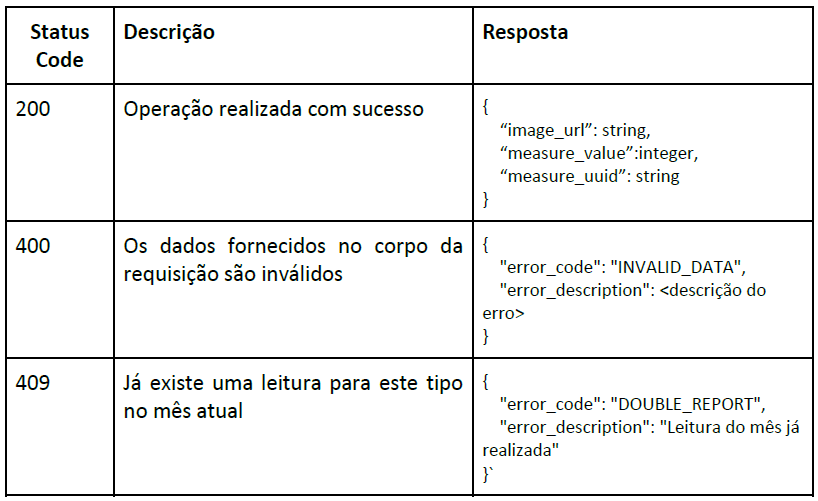
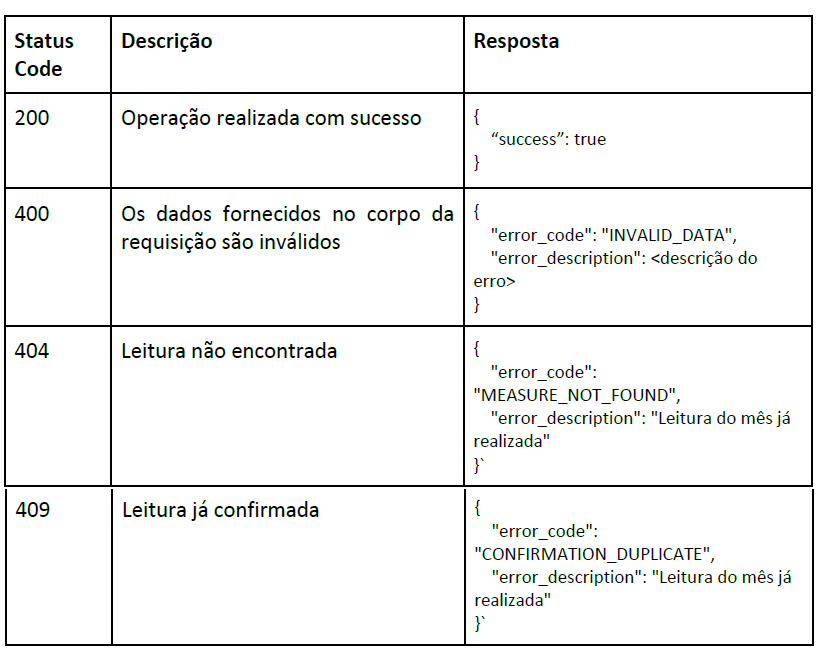
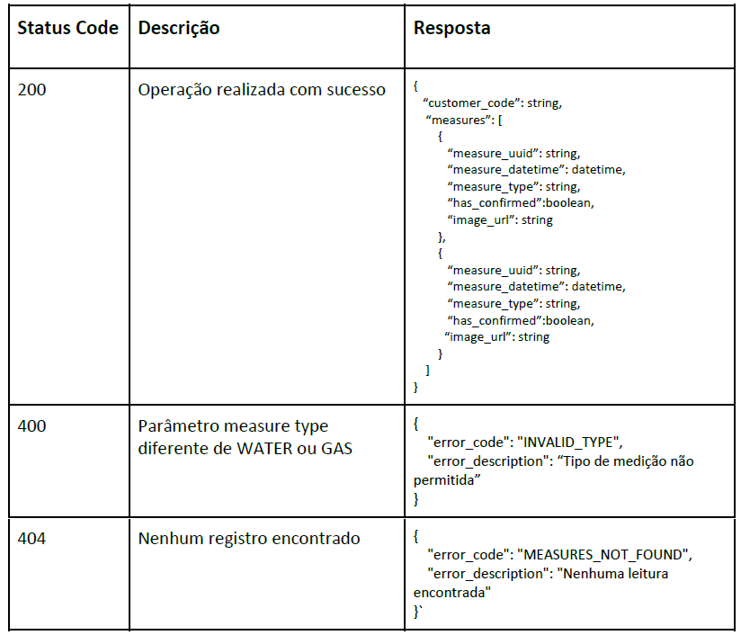

# ShopperProject

### Guia de início rápido

- Clone o repositório: https://github.com/juliocesar1316/ShopperProject.git
- Instale as dependências: **npm install**
- Suba os contêineres Docker: **docker-compose up --build**
- Assim que subir o contêiner ele estara rodando
- O projeto estará disponível em **`http://localhost:80/`**
- Documentação swagger para visualizar os endpoints **http://localhost:80/api-docs**
    (O retorno do swagger só funciona quando a aplicação estiver rodando)

### Guia de prováveis erros

- A aplicação só ira rodar quando as dependências estiverem sidos instaladas então será necessário executar o comando **npm install**
- Ás portas de acesso estão disponível para a porta 80, em caso de troca de porta de acesso será necessário alterar as portas do arquivo **Dockerfile**, **config.ts** e o arquivo **docker-compose.yml**.
- A dependência que faz a conexão com a IA LLM utiliza o node 18, caso retorne erro será necessário atualizar o node.

### CENÁRIO

Vamos desenvolver o back-end de um serviço que gerencia a leitura individualizada de 
consumo de água e gás. Para facilitar a coleta da informação, o serviço utilizará IA para 
obter a medição através da foto de um medidor.
O back-end deverá conter os seguintes endpoints:


#### POST /upload 
Responsável por receber uma imagem em base 64, consultar o Gemini e retornar a 
medida lida pela API

Esse endpoint deve:

- Validar o tipo de dados dos parâmetros enviados (inclusive o base64)
- Verificar se já existe uma leitura no mês naquele tipo de leitura.
- Integrar com uma API de LLM para extrair o valor da imagem

Ela irá retornar:

- Um link temporário para a imagem
- Um GUID
- O valor numérico reconhecido pela LLM

  #### Request Body
  ```
    {
      "image": "base64",
      "customer_code": "string",
      "measure_datetime": "datetime",
      "measure_type": "WATER" ou "GAS"
    }
  ```

  #### Response Body:

  


##### Documentação técnica do Google Gemini (LLM):
- https://ai.google.dev/gemini-api/docs/api-key
- https://ai.google.dev/gemini-api/docs/vision

**ATENÇÃO**: Você precisará obter uma chave de acesso para usar a funcionalidade. Ela é 
gratuita. Não realize despesas financeiras para realizar esse teste.

#### PATCH /confirm
Responsável por confirmar ou corrigir o valor lido pelo LLM,

Esse endpoint deve:

- Validar o tipo de dados dos parâmetros enviados
- Verificar se o código de leitura informado existe
- Verificar se o código de leitura já foi confirmado
- Salvar no banco de dados o novo valor informado

Ele **NÃO** deve fazer:
- Fazer novas consultas ao LLM para validar o novo resultado recebido

Ela irá retornar:
- Resposta de OK ou ERRO dependendo do valor informado.

#### Request Body
  ```
    {
      "measure_uuid": "string",
      "confirmed_value": integer
    }
  ```

#### Response Body


#### GET /`<customer code>` /list
Responsável por listar as medidas realizadas por um determinado cliente

Esse endpoint deve:
- Receber o código do cliente e filtrar as medidas realizadas por ele
- Ele opcionalmente pode receber um query parameter “measure_type”, que deve ser “WATER” ou “GAS”
    - A validação deve ser CASE INSENSITIVE
    - Se o parâmetro for informado, filtrar apenas os valores do tipo especificado. Senão, retornar todos os tipos.

  Ex. {base url}/<customer code>/list?measure_type=WATER

Ela irá retornar:
- Uma lista com todas as leituras realizadas.

#### Response Body

